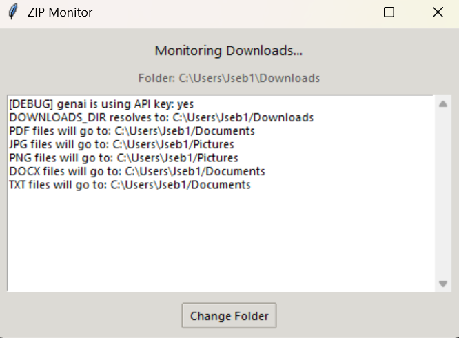

# ZipMonitor

A desktop application that automatically monitors your Downloads folder for ZIP files, scans them for security threats, extracts their contents, and organizes files by type into appropriate folders. ZipMonitor also provides AI-powered summaries of the extracted content.

## Features

- **Automatic Detection**: Monitors your Downloads folder (or any custom folder) for new ZIP files
- **Security Scanning**: Uses MetaDefender API to scan ZIP files for malware before extraction
- **Smart Extraction**: Safely extracts content and organizes files by type to appropriate folders
- **AI-Powered Summaries**: Generates intelligent summaries of file contents using Google's Gemini AI
- **Content Support**: Handles various file types including text, PDF, images, and more
- **User-Friendly Interface**: Modern UI with real-time status updates and logging
- **System Tray Integration**: Runs quietly in the background with a system tray icon

## How It Works

1. ZipMonitor watches your Downloads folder for new ZIP files
2. When a ZIP file is detected, it's scanned for security threats using MetaDefender
3. If the file is safe, it's extracted to a temporary folder
4. The AI analyzes each extracted file and generates informative summaries
5. Files are sorted by type and moved to appropriate directories (Documents, Pictures, etc.)
6. A summary file is created in the Downloads folder with AI-generated content descriptions

## Getting Started

### Prerequisites

- Python 3.8 or higher
- Required Python packages (install via `pip install -r requirements.txt`)

### Installation

1. Clone this repository:
2. Install dependencies:
3. Create a `.env` file with your API keys:
GOOGLE_API_KEY=your_google_api_key

### Running the Application

Run the application with:
python UI.py
